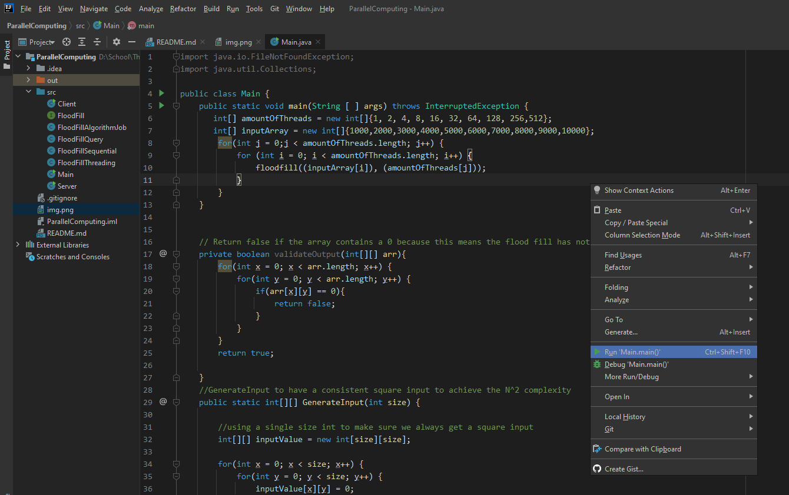

# ParallelComputing
Parallel Computing with Stijn Klopper & Tarik Yildirim

# How to install 
1. Copy the GIT url shown above. 
2. Create a folder to place the project in
3. Open up CMD/Bash/Command line interface and paste the following ``git clone *_URL_*``

# How to run 
1. To run our project Java should be installed on the operating system. We recommend Java 8
   since the project is made in Java 8.
2. Open up the project in a Java Editor/Compiler we recommend IntelliJ from Jetbrains.
3. In the directory 'src' the [Main.java](src/Main.java) can be opened up in the editor.
4. The file can be run using either pressing right-mouse click and then choosing the option run Main.main() shown in the image below
!

### Additional
5. To run the RMI system first run the [Server.java](src/Server.java) file and after the console prints out the message saying ``Server is started!`` 
6. After the server is running please run the [Client.java](src/Client.java) class using the same method